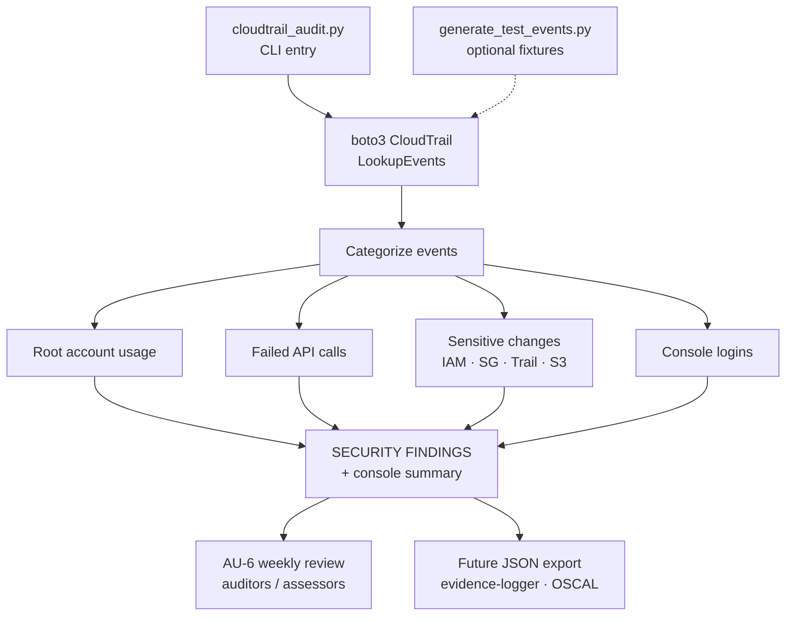

# CloudTrail Audit

I use this when I need a 24-hour CloudTrail pass sorted into four buckets: root
account usage, failed API calls, a fixed list of sensitive IAM / security-group /
trail / S3 changes, and console logins. Default lookback is `HOURS_TO_LOOK_BACK = 24`
in `cloudtrail_audit.py`. It calls `LookupEvents`, so you get Event History without
standing up a dedicated trail for the last 90 days of management events.

Pagination is not implemented yet. If the window returns more than one page, you
only see the first. Findings print to the console; there is no JSON export today.

## Compliance Controls Addressed

| NIST 800-53 Rev 5 | FedRAMP High | CJIS v6.1 | Validation Method |
|--------------------|:------------:|:---------:|-------------------|
| AU-2 Event Logging | Yes | - | Consumes the CloudTrail event stream produced by AU-2 logging |
| AU-3 Content of Audit Records | Yes | - | Extracts who / what / when / source from each event |
| AU-6 Audit Record Review | Yes | 1-year retention, weekly review | Primary use case: root, failed, sensitive, console-login categories |
| AU-12 Audit Record Generation | Yes | - | Flags `StopLogging` / `DeleteTrail` / `UpdateTrail` events |
| SI-4 System Monitoring | Yes | - | Categorizes the CloudTrail stream for review |
| IA-2 Identification and Authentication | Yes | - | Root account usage detection |

## Overview

Two scripts:

1. **`cloudtrail_audit.py`** - Analyzes CloudTrail events for security-relevant activity.
2. **`generate_test_events.py`** - Creates test events to verify detection.

## Architecture Overview



Editable Mermaid source (kept in sync with the fence above): [`docs/architecture.mmd`](docs/architecture.mmd).

`cloudtrail_audit.py` pulls the lookback window, sorts events into the four
categories above, and prints a SECURITY FINDINGS block plus a count summary.
`generate_test_events.py` is optional; wait 5 to 15 minutes after it runs before
re-auditing so CloudTrail has time to catch up.

## Requirements

- Python 3.x
- `boto3` library
- AWS CLI configured with credentials (`aws configure`)

### Install dependencies

```bash
pip install boto3
```

## Usage

### Run the audit

```bash
python cloudtrail_audit.py
```

**Sample output:**

```
Searching events from 2026-01-15 20:32:48+00:00 to 2026-01-16 20:32:48+00:00
(Last 24 hours)

Found 50 events. Analyzing for suspicious activity...

============================================================
SECURITY FINDINGS
============================================================

[1] ROOT ACCOUNT USAGE: 0 event(s)

[2] FAILED API CALLS: 0 event(s)

[3] SENSITIVE API CALLS: 3 event(s)
    [INFO] 2026-01-16 12:19:51 | AuthorizeSecurityGroupIngress | User: aws-grc-engineering-admin
    [INFO] 2026-01-16 12:19:51 | DeleteSecurityGroup | User: aws-grc-engineering-admin
    [INFO] 2026-01-16 12:19:50 | CreateSecurityGroup | User: aws-grc-engineering-admin

[4] CONSOLE LOGINS: 0 event(s)

============================================================
SUMMARY
============================================================
Total events analyzed: 50
Root account events:   0
Failed API calls:      0
Sensitive API calls:   3
Console logins:        0
```

### Generate test events (optional)

```bash
python generate_test_events.py
# Wait 5-15 minutes for CloudTrail to log events
python cloudtrail_audit.py
```

## Detection Categories

| Category | Description | Severity | Controls |
|----------|-------------|----------|----------|
| **Root Account Usage** | Any API call made by root account | CRITICAL | IA-2, AU-6, SI-4 |
| **Failed API Calls** | API calls that returned an error | WARN | AU-6, SI-4 |
| **Sensitive API Calls** | IAM, security group, logging, S3 policy changes | INFO | AU-6, AU-12, SI-4 |
| **Console Logins** | AWS Management Console sign-ins | INFO | AU-6, IA-2 |

## Sensitive Events Monitored

### IAM Events (AC-2, AC-6)
- `CreateUser`, `DeleteUser`
- `CreateAccessKey`, `DeleteAccessKey`
- `AttachUserPolicy`, `DetachUserPolicy`, `PutUserPolicy`
- `CreateRole`, `DeleteRole`, `AttachRolePolicy`

### EC2 Security Group Events (SC-7, CM-7)
- `CreateSecurityGroup`, `DeleteSecurityGroup`
- `AuthorizeSecurityGroupIngress`, `AuthorizeSecurityGroupEgress`

### CloudTrail Events (AU-12)
- `StopLogging`, `DeleteTrail`, `UpdateTrail` (direct attacks on the audit infrastructure itself)

### S3 Events (AC-3, AC-21, SC-28)
- `PutBucketPolicy`, `DeleteBucketPolicy`, `PutBucketAcl`

## Configuration

Edit these variables in `cloudtrail_audit.py`:

```python
# How far back to search (in hours)
HOURS_TO_LOOK_BACK = 24

# Add/remove events to monitor
SENSITIVE_EVENTS = {
    'ConsoleLogin',
    'CreateUser',
    # ...
}
```

## How an Auditor Uses This Output

For an AU-6 weekly review I run this once, paste the SUMMARY counts into the
review note, and keep the per-event lines as the backing detail. Root usage is
the CRITICAL line. Trail tampering events (`StopLogging`, `DeleteTrail`,
`UpdateTrail`) sit in the sensitive list because they attack the log source
itself. This is a review aid, not a substitute for retaining the underlying
CloudTrail objects for the required period.

## FedRAMP 20x Alignment

The four categories give you stable numerator counts you can trend: root events,
failed calls, sensitive changes, console logins. I have not attached those counts
to a KSI dashboard or emitted OSCAL Assessment Results yet. The next useful step
is JSON with a control ID on each finding so `evidence-logger` and the OSCAL
tooling can take the file without a manual reshape.

## CJIS v6.1 Relevance

CJIS v6.1 hardens AU-6 for CJI: keep audit records at least 1 year, review them
weekly. Released June 25, 2026; v6.x the default audit baseline since April 1,
2026; Priority 2-4 fully enforceable Oct 1, 2027. This script is the weekly review
pass for the last 24 hours (or whatever you set `HOURS_TO_LOOK_BACK` to). It does
not enforce retention; that still belongs on the S3 side (Object Lock, lifecycle).
A planned `--weekly-review` flag would write a structured review record shaped for
`evidence-logger`.

## Roadmap

This lands in the Unified Evidence Collector (Project 4) with `s3-audit`,
`sg-audit`, and `evidence-logger`. Before that, I want NextToken pagination, JSON
export with per-finding control IDs, SNS on CRITICAL findings, and the
`--weekly-review` record path into
[`oscal-evidence-pipeline`](https://github.com/0xBahalaNa/oscal-evidence-pipeline).

## Future Enhancements

- Add pagination for more events (NextToken)
- Export findings to CSV / JSON for OSCAL pipelines
- Email / SNS alerts for CRITICAL findings (root usage, trail tampering)
- Filter by user, IP address, or source ARN
- Command-line arguments (argparse) for time range, suite selection
- Detect specific attack patterns (impossible-travel, privilege escalation chains)
- `--weekly-review` flag emitting structured review records (CJIS AU-6 delta)

## Framework Reference

Control family mappings and AWS implementation details are documented in [nist-800-53-rev-5-to-aws-mapping](https://github.com/0xBahalaNa/nist-800-53-rev-5-to-aws-mapping).

## License

MIT
